# TotemConnect - Documentación del Sistema

> Sistema POS para restaurantes – Frontend React + Backend Node.js/Express + PostgreSQL

---

## Diagrama de Flujo General

```mermaid
graph TB
    subgraph Auth["🔐 Autenticación"]
        LOGIN["/login<br/>LoginPage.tsx"] --> POST_LOGIN["POST /api/auth/login"]
        POST_LOGIN --> AUTH_SERVICE["AuthService.login()"]
        AUTH_SERVICE --> DB_USERS[("users")]
        AUTH_SERVICE --> JWT["Retorna JWT"]
        JWT --> ZUSTAND["Zustand Store<br/>auth.store.ts"]
    end

    subgraph Dash["📊 Dashboard"]
        DASH["/dashboard<br/>DashboardPage.tsx"] --> ROLE{"user.role?"}
        ROLE -->|mesero| MESA_LINK["Mesas"]
        ROLE -->|admin| ADMIN_LINKS["Cocina, Ventas,<br/>Productos, Categorías,<br/>Mesas, Usuarios"]
    end

    subgraph Mesas["🪑 Gestión de Mesas"]
        MESAS["/mesas<br/>MesasPage.tsx"] --> GET_MESAS["GET /api/mesas"]
        GET_MESAS --> MESA_SERVICE["MesaService.findAll()"]
        MESA_SERVICE --> DB_MESAS[("mesas + pedidos + users")]
        MESAS -->|click mesa libre| INICIAR["POST /api/pedidos/iniciar"]
        INICIAR --> PEDIDO_SERVICE1["PedidoService.iniciar()"]
        PEDIDO_SERVICE1 --> DB_PEDIDO_CREATE[("INSERT pedido<br/>UPDATE mesa → ocupada")]
        PEDIDO_SERVICE1 --> SOCKET_PC["🔌 emit: pedido:creado"]
        INICIAR --> PEDIDO_PAGE
        MESAS -->|click mesa ocupada| PEDIDO_PAGE
    end

    subgraph Pedido["📋 Pedido"]
        PEDIDO_PAGE["/pedido/:id<br/>PedidoPage.tsx"] --> LOAD_PEDIDO["GET /api/pedidos/:id"]
        LOAD_PEDIDO --> PEDIDO_SERVICE2["PedidoService.findById()"]
        PEDIDO_SERVICE2 --> DB_PEDIDO[("pedidos + detalles<br/>+ productos + pagos")]
        PEDIDO_PAGE --> LOAD_CATS["GET /api/categorias/activas"]
        PEDIDO_PAGE --> LOAD_PRODS["GET /api/productos/agrupados"]
        PEDIDO_PAGE -->|agregar item| ADD_ITEM["POST /api/pedidos/agregar-item"]
        ADD_ITEM --> PEDIDO_SERVICE3["PedidoService.agregarItem()"]
        PEDIDO_SERVICE3 --> DB_DETALLE[("INSERT/UPDATE detalle_pedidos<br/>RECALCULA pedidos.total")]
        ADD_ITEM --> SOCKET_IA["🔌 emit: pedido:item_agregado"]
        PEDIDO_PAGE -->|eliminar item| DEL_ITEM["DELETE /api/pedidos/eliminar-item/:id"]
        DEL_ITEM --> PEDIDO_SERVICE3
        PEDIDO_PAGE -->|Entregar| ENTREGAR["POST /api/pedidos/entregar"]
        ENTREGAR --> PEDIDO_SERVICE4["PedidoService.entregar()"]
        PEDIDO_SERVICE4 --> DB_ENTREGAR[("UPDATE detalle → entregado<br/>UPDATE pedido → entregado")]
        ENTREGAR --> SOCKET_ENT["🔌 emit: pedido:entregado"]
        PEDIDO_PAGE -->|Pagar| PAGO_PAGE
    end

    subgraph Pago["💳 Pago"]
        PAGO_PAGE["/pago/:id<br/>PagoPage.tsx"] --> LOAD_PAGOS["GET /api/pagos/:pedidoId"]
        LOAD_PAGOS --> PAGO_SERVICE1["PagoService.getByPedido()"]
        PAGO_SERVICE1 --> DB_PAGOS[("pagos_parciales")]
        PAGO_PAGE -->|Dividir equitativo| DIV_EQ["POST /api/pagos/dividir-equitativo"]
        DIV_EQ --> PAGO_SERVICE2["PagoService.dividirEquitativo()"]
        PAGO_SERVICE2 --> DB_DIV[("Cancela pendientes<br/>Crea N pagos parciales")]
        PAGO_PAGE -->|Cobrar pago| COBRAR["POST /api/pagos/procesar"]
        COBRAR --> PAGO_SERVICE3["PagoService.procesarPago()"]
        PAGO_SERVICE3 --> SIMULA["Simula POS (95% ok)"]
        SIMULA -->|aprobado| DB_APRUEBA[("UPDATE pago → aprobado<br/>+ transaccionId")]
        SIMULA -->|rechazado| DB_RECHAZA[("UPDATE pago → rechazado<br/>+ mensajeRespuesta")]
        COBRAR --> SOCKET_PAG["🔌 emit: pago:procesado"]
        PAGO_PAGE -->|Cerrar cuenta| CERRAR["POST /api/pagos/cerrar-cuenta"]
        CERRAR --> PAGO_SERVICE4["PagoService.cerrarCuenta()"]
        PAGO_SERVICE4 --> DB_CERRAR[("UPDATE pedido → cerrado<br/>UPDATE mesa → libre<br/>INSERT historial_pedido<br/>INSERT historial_mesa")]
        CERRAR --> SOCKET_CC["🔌 emit: pedido:cerrado"]
    end

    subgraph Cocina["👨‍🍳 Cocina"]
        COCINA["/cocina<br/>KitchenDisplayPage.tsx"] --> GET_MESAS_COCINA["GET /api/mesas"]
        COCINA -->|Marcar listo| ENTREGAR_COC["POST /api/pedidos/entregar"]
        COCINA -->|Reimprimir| REPRINT["POST /api/pedidos/reimprimir/:id"]
        REPRINT --> PRINT_SERVICE["PrintService.imprimirPedido()"]
        PRINT_SERVICE --> IMPRESORA["🖨️ Impresora ESC/POS"]
    end

    subgraph Admin["⚙️ Admin"]
        CATS["/admin/categorias"] --> CRUD_CATS["CRUD /api/categorias<br/>CategoriaService"]
        PRODS["/admin/productos"] --> CRUD_PRODS["CRUD /api/productos<br/>Upload imagen / Import Excel<br/>ProductoService"]
        MESAS_ADMIN["/admin/mesas"] --> CRUD_MESAS["CRUD /api/mesas<br/>MesaService"]
        USERS["/admin/usuarios"] --> CRUD_USERS["CRUD /api/auth/usuarios<br/>AuthService"]
        VENTAS["/ventas<br/>VentasPage.tsx"] --> GET_VENTAS["GET /api/pedidos/ventas"]
        GET_VENTAS --> PEDIDO_SERVICE5["PedidoService.listarVentas()"]
        PEDIDO_SERVICE5 --> DB_VENTAS[("pedidos cerrados + filtros")]
    end

    subgraph Socket["🔌 Socket.io"]
        SOCKET_SERVER["initSocket()<br/>server → rooms"]
        MESA_ROOM["room: mesa:<id>"]
        COCINA_ROOM["room: cocina"]
    end

    LOGIN --> DASH
    DASH --> MESAS
    PEDIDO_PAGE --> PAGO_PAGE
    PAGO_PAGE --> MESAS
    SOCKET_PC --> COCINA
    SOCKET_IA --> PEDIDO_PAGE
    SOCKET_ENT --> PEDIDO_PAGE
    SOCKET_PAG --> PAGO_PAGE
    SOCKET_CC --> MESAS
```



---

## 1. Arquitectura General

```
┌─────────────────────────────────────────────────────┐
│                   Frontend (React + Vite)            │
│                    localhost:5173                     │
│  ┌─────────┐ ┌──────────┐ ┌────────┐ ┌───────────┐  │
│  │ Páginas  │ │  Stores  │ │ Socket │ │  API lib  │  │
│  │ (11)     │ │ (Zustand)│ │ (io)   │ │ (Axios)   │  │
│  └────┬─────┘ └──────────┘ └───┬────┘ └─────┬─────┘  │
│       │                        │            │         │
└───────┼────────────────────────┼────────────┼─────────┘
        │ proxy Vite             │ ws         │ /api
        ▼                        ▼            ▼
┌─────────────────────────────────────────────────────┐
│              Backend (Node.js + Express)              │
│                    localhost:3000                     │
│  ┌─────────┐ ┌──────────┐ ┌────────┐ ┌───────────┐  │
│  │  Routes  │ │ Services │ │Socket  │ │Middleware  │  │
│  │ (47)     │ │ (6)      │ │Gateway │ │(auth, etc)│  │
│  └────┬─────┘ └────┬─────┘ └───┬────┘ └───────────┘  │
│       │            │           │                       │
└───────┼────────────┼───────────┼───────────────────────┘
        │            │           │
        ▼            ▼           ▼
┌─────────────────────────────────────────────────────┐
│                 PostgreSQL + Prisma                   │
│                   Tablas: 9                           │
│  users, categorias, productos, mesas, pedidos,        │
│  detalle_pedidos, pagos_parciales, historial_pedido,  │
│  historial_mesa                                        │
└─────────────────────────────────────────────────────┘
```

---

## 2. Páginas del Frontend (11)

| Ruta | Componente | Descripción |
|------|-----------|-------------|
| `/login` | `LoginPage` | Login con email/password, almacena JWT |
| `/` | `DashboardPage` | Menú principal según rol (mesero vs admin) |
| `/mesas` | `MesasPage` | Grid de mesas, crear pedido, navegar a pedido |
| `/pedido/:id` | `PedidoPage` | Gestión de pedido: agregar/eliminar items, entregar, pagar |
| `/pago/:id` | `PagoPage` | División de cuenta, cobro por método, cerrar cuenta |
| `/ventas` | `VentasPage` | Reporte de ventas con filtros (admin) |
| `/cocina` | `KitchenDisplayPage` | Pantalla de cocina con pedidos entrantes, temporizador |
| `/admin/categorias` | `MantenedorCategoriasPage` | CRUD categorías (admin) |
| `/admin/productos` | `MantenedorProductosPage` | CRUD productos + imágenes + Excel (admin) |
| `/admin/mesas` | `MantenedorMesasPage` | CRUD mesas (admin) |
| `/admin/usuarios` | `AdminUsuariosPage` | CRUD usuarios/meseros (admin) |

---

## 3. API Endpoints por Módulo

### Auth
| Método | Ruta | Middleware | Función |
|--------|------|-----------|---------|
| POST | `/api/auth/login` | — | Login |
| POST | `/api/auth/register` | — | Registro mesero |
| GET | `/api/auth/me` | auth | Perfil actual |
| GET | `/api/auth/usuarios` | auth + admin | Listar usuarios |
| POST | `/api/auth/usuarios` | auth + admin | Crear usuario |

### Categorías
| Método | Ruta | Middleware | Función |
|--------|------|-----------|---------|
| GET | `/api/categorias` | auth | Todas (con inactivas si admin) |
| GET | `/api/categorias/activas` | auth | Solo activas |
| GET | `/api/categorias/:id` | auth | Por ID |
| POST | `/api/categorias` | auth + admin | Crear |
| PUT | `/api/categorias/:id` | auth + admin | Actualizar |
| PATCH | `/api/categorias/:id/toggle` | auth + admin | Activar/desactivar |
| DELETE | `/api/categorias/:id` | auth + admin | Eliminar |

### Productos
| Método | Ruta | Middleware | Función |
|--------|------|-----------|---------|
| GET | `/api/productos` | auth | Todos |
| GET | `/api/productos/activos` | auth | Solo activos |
| GET | `/api/productos/agrupados` | auth | Agrupados por categoría |
| GET | `/api/productos/:id` | auth | Por ID |
| POST | `/api/productos` | auth + admin | Crear |
| PUT | `/api/productos/:id` | auth + admin | Actualizar |
| PATCH | `/api/productos/:id/toggle` | auth + admin | Activar/desactivar |
| DELETE | `/api/productos/:id` | auth + admin | Eliminar |
| POST | `/api/productos/:id/imagen` | auth + admin + multer | Subir imagen |
| POST | `/api/productos/importar-excel` | auth + admin + multer | Importar Excel |

### Mesas
| Método | Ruta | Middleware | Función |
|--------|------|-----------|---------|
| GET | `/api/mesas` | auth | Todas con pedidos activos |
| GET | `/api/mesas/con-pedido/:id` | auth | Mesa con pedido activo |
| GET | `/api/mesas/por-pedido/:pedidoId` | auth | Buscar por pedido |
| GET | `/api/mesas/:id` | auth | Por ID |
| POST | `/api/mesas` | auth + admin | Crear |
| PUT | `/api/mesas/:id` | auth + admin | Actualizar |
| PATCH | `/api/mesas/:id/liberar` | auth | Liberar mesa |
| DELETE | `/api/mesas/:id` | auth + admin | Eliminar |

### Pedidos
| Método | Ruta | Middleware | Función |
|--------|------|-----------|---------|
| GET | `/api/pedidos/:id` | auth | Pedido por ID (con detalles, pagos) |
| POST | `/api/pedidos/iniciar` | auth | Iniciar pedido en mesa |
| POST | `/api/pedidos/agregar-item` | auth | Agregar item al pedido |
| DELETE | `/api/pedidos/eliminar-item/:id` | auth | Eliminar item |
| POST | `/api/pedidos/entregar` | auth | Marcar items como entregados |
| GET | `/api/pedidos/ventas` | auth + admin | Reporte de ventas filtrado |
| POST | `/api/pedidos/reimprimir/:id` | auth | Reimprimir comanda |

### Pagos
| Método | Ruta | Middleware | Función |
|--------|------|-----------|---------|
| GET | `/api/pagos/:pedidoId` | auth | Pagos del pedido |
| POST | `/api/pagos/dividir-equitativo` | auth | División equitativa |
| POST | `/api/pagos/dividir-por-items` | auth | División por items |
| POST | `/api/pagos/procesar` | auth | Procesar pago individual |
| POST | `/api/pagos/cerrar-cuenta` | auth | Cerrar cuenta + liberar mesa |
| POST | `/api/pagos/webhook` | — | Webhook externo |

---

## 4. Servicios del Backend (6)

| Servicio | Funciones principales | Operaciones BD |
|----------|----------------------|----------------|
| **AuthService** | login, register, me, listar, crear | users (SELECT, INSERT) |
| **CategoriaService** | findAll, findById, create, update, toggleActivo, remove | categorias (CRUD) + count productos |
| **ProductoService** | findAll, findGrouped, findById, create, update, toggleActivo, remove, updateImage | productos (CRUD) + JOIN categorias |
| **MesaService** | findAll, findById, getConPedido, findByPedido, create, update, liberar, remove | mesas (CRUD) + JOIN pedidos |
| **PedidoService** | findById, iniciar, agregarItem, eliminarItem, entregar, listarVentas | pedidos, detalle_pedidos (CRUD) + recalcular total |
| **PagoService** | getByPedido, dividirEquitativo, dividirPorItems, procesarPago, cerrarCuenta, webhookCallback | pagos_parciales (CRUD) + historial_pedido + historial_mesa |
| **PrintService** | imprimirPedido | Envío a impresora térmica ESC/POS vía TCP/IP |

---

## 5. Modelo de Datos (PostgreSQL)

```
┌─────────────┐     ┌──────────────┐     ┌──────────────────┐
│    users    │     │  categorias  │     │    productos     │
├─────────────┤     ├──────────────┤     ├──────────────────┤
│ id (PK)     │     │ id (PK)      │     │ id (PK)          │
│ name        │     │ nombre       │     │ categoria_id(FK) │────┐
│ email (UQ)  │     │ icono        │     │ nombre           │    │
│ password    │     │ activo       │     │ precio           │    │
│ role        │     │ created_at   │     │ imagen           │    │
│ created_at  │     └──────┬───────┘     │ activo           │    │
│ updated_at  │            │            │ created_at       │    │
└──────┬──────┘            │            └──────────────────┘    │
       │                   │                                   │
       │    ┌──────────────┘                                   │
       │    │                                                  │
       │    │    ┌─────────────────┐     ┌─────────────────────┘
       │    │    │ detalle_pedidos │     │
       │    │    ├─────────────────┤     │
       │    │    │ id (PK)         │     │
       │    └────┤ pedido_id (FK)  │     │
       │         │ producto_id(FK) │─────┘
       │         │ cantidad        │
       │         │ precio_unitario │
       │         │ subtotal        │
       │         │ entregado       │
       │         │ created_at      │
       │         └────────┬────────┘
       │                  │
       │    ┌─────────────┘
       │    │
       │    │    ┌──────────────┐     ┌───────────────────┐
       │    │    │   pedidos    │     │  pagos_parciales  │
       │    │    ├──────────────┤     ├───────────────────┤
       │    └────┤ id (PK)      │     │ id (PK)           │
       │         │ mesa_id (FK) │────┐│ pedido_id (FK)    │
       └─────────┤ user_id (FK) │    ││ monto             │
                 │ estado        │    ││ metodo            │
                 │ total         │    ││ tipo_division     │
                 │ created_at    │    ││ items_ids (JSON)  │
                 │ updated_at    │    ││ estado            │
                 └───────┬───────┘    ││ transaccion_id    │
                         │            ││ mensaje_respuesta │
                         │            ││ created_at        │
                         │            ││ updated_at        │
                         │            └───────────────────┘
                         │
              ┌──────────┴──────────────────┐
              │                             │
    ┌──────────────────┐     ┌──────────────────────┐
    │ historial_pedido │     │   historial_mesa     │
    ├──────────────────┤     ├──────────────────────┤
    │ id (PK)          │     │ id (PK)              │
    │ pedido_id (FK)   │     │ mesa_id (FK)         │
    │ user_id (FK)     │     │ user_id (FK)         │
    │ estado_anterior  │     │ estado_anterior      │
    │ estado_nuevo     │     │ estado_nuevo         │
    │ observacion      │     │ pedido_id (FK)       │
    │ created_at       │     │ observacion          │
    └──────────────────┘     │ created_at           │
                             └──────────────────────┘
```

---

## 6. Eventos Socket.io

| Evento | Dirección | Payload | Disparado por |
|--------|-----------|---------|---------------|
| `mesa:estado` | Server → Todos | `{ mesaId, estado }` | Cambio de estado de mesa |
| `pedido:creado` | Server → Mesa + Cocina | `{ pedidoId, mesaId }` | Nuevo pedido iniciado |
| `pedido:item_agregado` | Server → Mesa | `{ pedidoId, items, total }` | Item agregado/eliminado |
| `pedido:entregado` | Server → Mesa | `{ pedidoId }` | Items marcados como entregados |
| `pedido:cerrado` | Server → Mesa | `{ pedidoId }` | Cuenta cerrada |
| `pago:procesado` | Server → Mesa | `{ pagoId, estado }` | Pago procesado (ok/rechazado) |

**Salas (rooms):**
- `mesa:<mesaId>` — Usuarios viendo una mesa específica
- `cocina` — Pantalla de cocina

---

## 7. Flujo de Usuario Típico (Mesero)

```
Login → Dashboard → Mesas → Click mesa libre →
  Pedido (agregar productos) → Entregar →
  Pagar → Dividir cuenta → Cobrar cada pago →
  Cerrar cuenta → Vuelve a Mesas
```

## 8. Flujo de Usuario Típico (Cocina)

```
Login → Dashboard → Cocina →
  Recibe pedido nuevo (alerta sonora) →
  Prepara items → Click "Marcar Listo" →
  (opcional) Reimprimir comanda
```

---

## 9. Tecnologías

| Capa | Tecnología |
|------|-----------|
| Frontend | React 19, TypeScript, Vite, Tailwind CSS 4, Zustand, Axios, Socket.io-client |
| Backend | Node.js, Express, TypeScript, Prisma ORM, Socket.io, Zod, Multer |
| Base de datos | PostgreSQL |
| Tiempo real | Socket.io (WebSocket + polling) |
| Autenticación | JWT (jsonwebtoken + bcryptjs) |
| Impresión | ESC/POS sobre TCP/IP |
| Archivos | Multer (upload de imágenes y Excel) |

---

> Documentación generada el 12/07/2026
